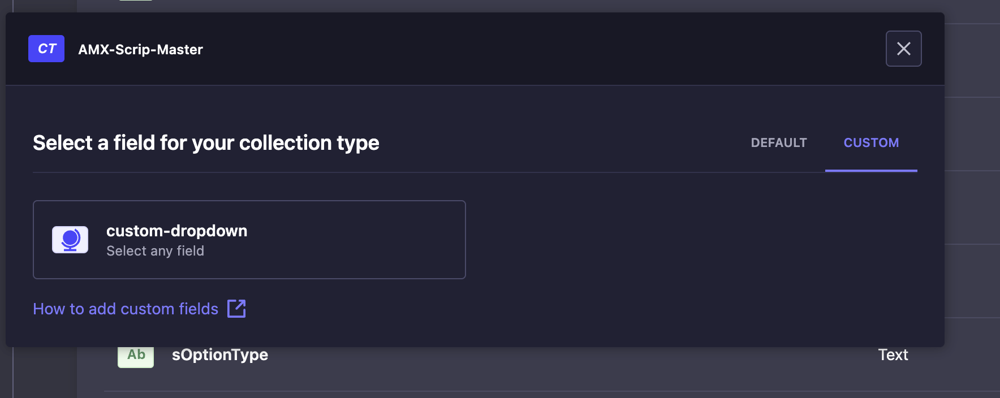
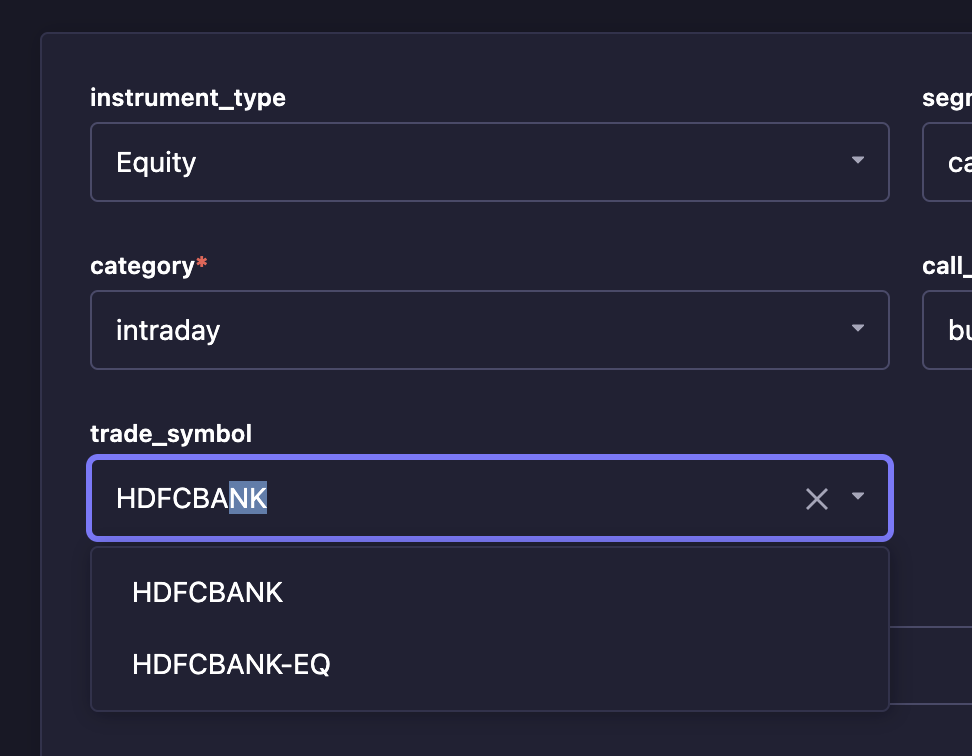

# Strapi plugin custom-searchable-dropdown

A strapi custom field for selecting any country based on the ISO 3166-1 country code standard.

## Installation

To install this plugin, you need to add an NPM dependency to your Strapi application:

```
# Using Yarn
yarn add strapi-plugin-custom-searchable-dropdown

# Or using NPM
npm install strapi-plugin-custom-searchable-dropdown
```

Then, you'll need to build your admin panel:

```
# Using Yarn
yarn build

# Or using NPM
npm run build
```


## Usage

After installation you will find the custom-dropdown at the custom fields section of the content-type builder.



Now you can search and select any custom scrip from the list.


